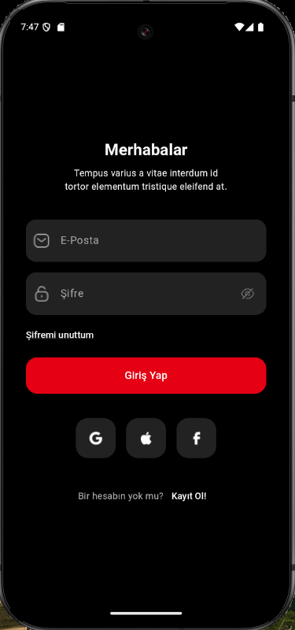
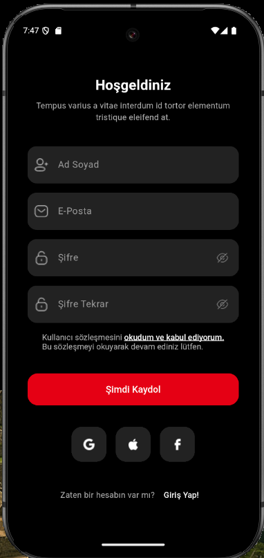
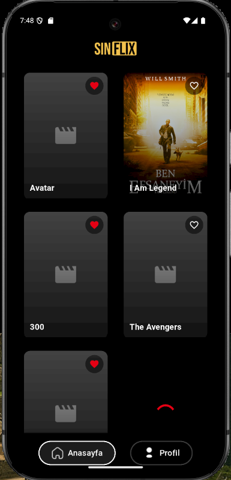
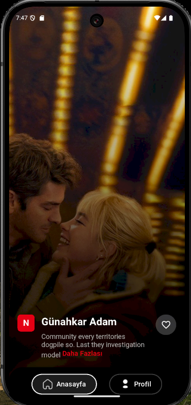
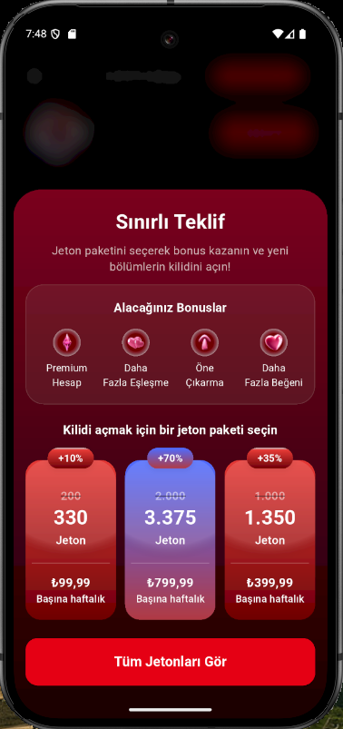
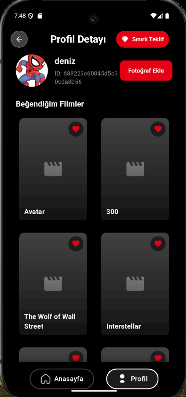
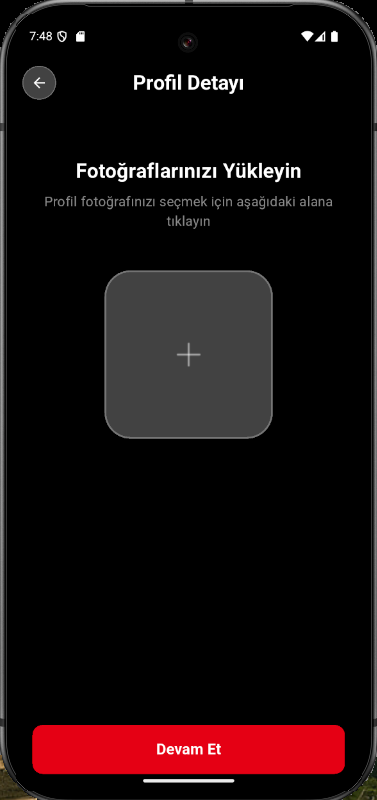
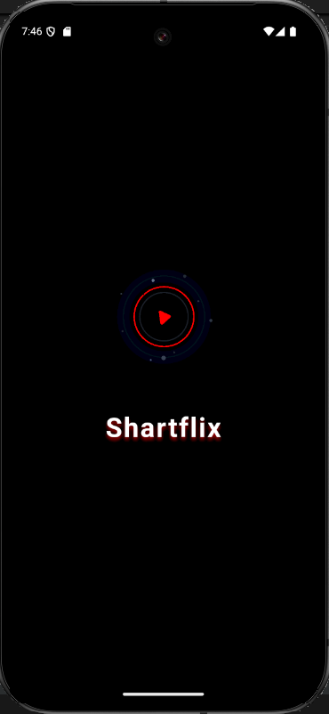

# SinFlix 🎬

<p align="left">
  
  
  
</p>

**SinFlix** is a modern Flutter-based movie application where users can explore trending films, manage their favorites, and enjoy a visually-rich, responsive mobile experience. It is built following clean architecture principles and industry best practices.

---

## 🌟 Key Features

### 1. Authentication
- Email and password login/register
- Independent password visibility toggle
- Social media login icons (as assets)
- All strings are managed from centralized files

### 2. Splash Screen & Preloading
- Lottie animation splash screen
- Preloads movie data during splash screen

### 3. Explore Movies
- Rich background visuals with gradient overlay
- Highlighted featured movie with description
- “See More” link and smooth transitions
- Like button and animations

### 4. Home Page
- Grid-style movie listing
- Infinite scroll and “load more” support
- Persistent local favorites that survive scroll events
- Add/remove favorite movies

### 5. Profile & Photo Upload
- Display user details and favorite films
- Upload profile image using `image_picker`
- Loading state management for uploads
- "Limited Offer" bottom modal with custom gradient and icons

### 6. Navigation & Bottom Bar
- Type-safe navigation with `auto_route`
- Custom-designed bottom navigation bar (all icons are assets)
- Special profile icon using layered image assets

### 7. Security & Data Handling
- Secure token management with Hive + crypto
- Token validation and expiration checks
- Synchronization of local and remote favorite movies

### 8. UI/UX & Design System
- Consistent spacing using `CustomSizedBox`
- Centralized color and text style management
- All icons and assets managed in a modular way
- Fully responsive design
- User feedback for error and loading states

---
### 9. App Icon
- Custom app icon added for both Android and iOS platforms

## 🧠 Tech Stack

| Technology         | Usage                              |
|--------------------|------------------------------------|
| Flutter            | Mobile app framework               |
| Dart               | Programming language               |
| Bloc       | State management                   |
| Dio                | REST API handling                  |
| Hive + crypto      | Secure local data & token storage  |
| auto_route         | Type-safe navigation               |
| Lottie             | Animations                         |
| image_picker       | Image upload                       |

---

## 🗂️ Project Structure

```bash
lib/
├── app/
│   ├── common/              # Shared components (widgets, themes, constants)
│   ├── features/            # Feature modules (e.g. profile, auth)
│   └── routes/              # Route definitions with auto_route
├── core/                    # Core services like networking and storage
├── main.dart                # Entry point of the application
```

---

## 🚀 Getting Started

```bash
flutter pub get
flutter run
```

---

## 📸 Screenshots

<table>
  <tr>
    <td align="center"></td>
    <td align="center"></td>
    <td align="center"></td>
    <td align="center"></td>
  </tr>
  <tr>
    <td align="center"></td>
    <td align="center"></td>
    <td align="center"></td>
    <td align="center"></td>
  </tr>
</table>

---

## ⚠️ License

> **This project is NOT licensed under MIT.**  
> All rights reserved by the developer.

---

## 👤 Developer

**Deniz Güvel**  
[GitHub Profile](https://github.com/your-username)

---